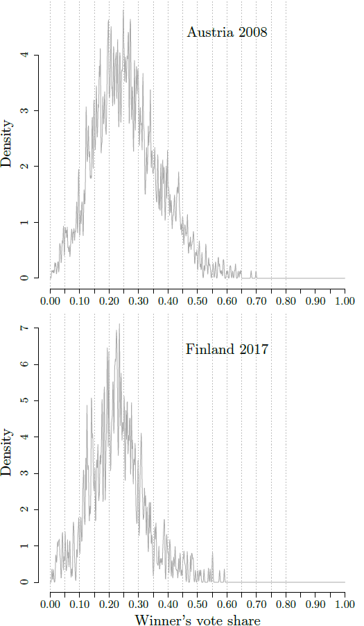
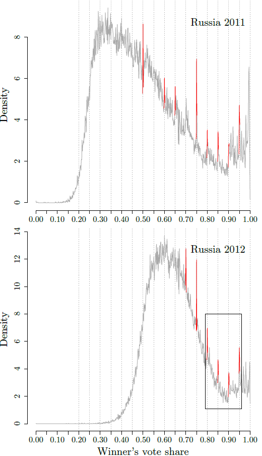
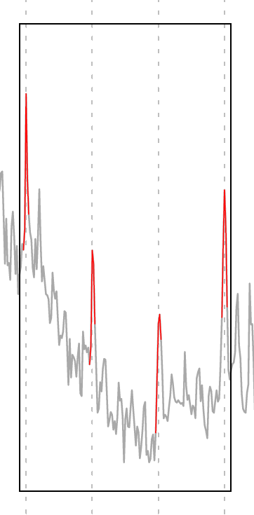
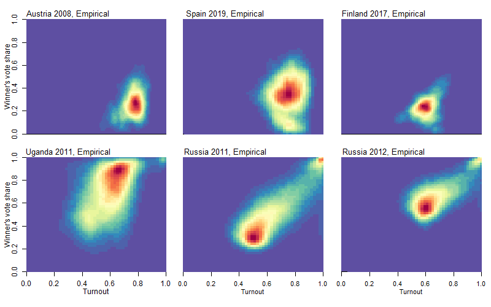
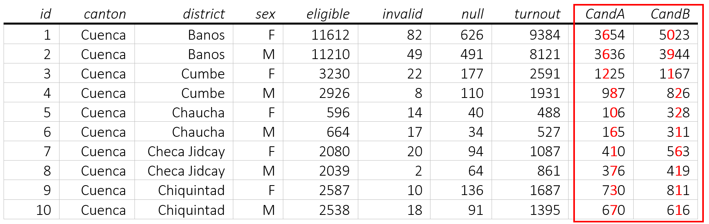

# Statistical Election Fraud Detection: Supervised Learning

## :star: Summary
I train a range of supervised machine learning methods (regularized regression, random forest, gradient boosting) on synthetic training data for the probabilistic detection of systematic manipulation in fine-graded election results. When constructing a fraud detection prototype in the context of elections, using empirical data for training comes with several challenges: 

- *Uncertainty of class membership.* Although for some elections in autocratic regimes, there are anecdotal observations (e.g. video footage, official observer reports) of manipulation at few localities, we do not know the exact degree and type of election fraud for any empirical case.  
- *Unbalanced class sizes.* The vast majority of conducted elections are clean. Supervised algorithms would need to learn from a small number of empirical cases. 
- *Few observations.* The number of empirical elections that we can use for training is not sufficient for learning high-order interactions and non-linearities across the feature space.  

In order to circumvent these challenges, I **train supervised models on synthetic election data** for which manipulation is incorporated in the data generating simulations and the type and degree of fraud is known. 

## :mortar_board: Which problem am I solving?
There is a range of statistical approaches available to separate anomalies from fraud-free processes in fine-graded election data. These focus on different numerical characteristics such as Benford patterns in digit distributions of observed vote counts, spikes in the density mass of turnout and vote share distributions around integer percentages, or skewness and kurtosis of turnout and support rates. These suffer from a **central problem:** 

- Each test is developed around one individual numerical characteristic of voting returns, while being agnostic to other features that have been sucessfull in identifying fraud
- It is unclear how inconclusive results across different numerical attributes weigh into substantive conclusions

:heavy_check_mark: I train supervised machine learning models on a multivariate feature space. This weights heterogeneous numerical approaches for fraud detection against each other

:heavy_check_mark: Unified statistical framework for probabilistic election fraud detection synthesizing multiple standalone tests with each other

## :microscope: Feature Engineering: How does fraudulent election data look like?

### 1. Spikes in the density mass of vote share distributions around integer values
- We can construct the distribution of vote shares for one candidate/party across a large number of units (e.g. polling stations) 
- In clean elections, distributions are relatively smooth with no systematic spikes around certain values
- Humans are bad at generating numbers that look random. Systematically *rounding up* vote shares for one candidate/party during vote counting leads to spikes in the density mass around *exactly integer values* that are multiples of 5 (e.g. 55%, 60%, 65%, 70%, ...)
- :large_blue_circle:**Features for machine learning:**:large_blue_circle: Density mass located at integer values that are multiples of 5

<p float="left">
  
   
   
</p>

### 2. Skewness and kurtosis in bivariate distribution p(turnout, vote share)
- In clean elections, the bivariate distribution between the level of turnout and a candidate's vote share across all polling stations is approximated reasonably well by two orthogonal Gaussian distributions 
- When *stuffing the ballot box* with pre-prepared ballots, systematic clusters, skewness and kurtosis that can be quantified appears in the distribution between the number of registered ballots (turnout) and the winner's vote share 
- :large_blue_circle:**Features for machine learning:**:large_blue_circle: Measures for skewness and kurtosis of the bivariate distribution p(turnout, vote share)

<p float="left">
  
</p>

### 3. Frequencies of digits (0,1,2,3,...) in the absolute number of votes per candidate 

<p float="left">
  
</p>

- Newcomb-Benford’s law (Newcomb 1881; Benford 1938) states that for a large set of numbers, the probability that the frequency of digit $d$ ($d \in {0, 1, 2, 3, 4, 5, 6, 7, 8, 9}$) arising in the *n*th position ($n > 1$) of the number decays logarithmically and can be defined as

$$P(d) = \sum_{k=10^{n-2}}^{10^{n-1}} log_{10} (1+\frac{1}{10k+d}).$$

- It has been shown that this law holds asymptotically if observed numbers are generated as mathematical mixtures of different distributions without being naturally biased towards a certain range of values. Under many circumstances, fine-graded election results fulfill these properties. 
- How closely empirical digit distributions resemble theoretically expected distributions primarily depends on how many data points are observed
- :large_blue_circle:**Features for machine learning:**:large_blue_circle: Deviations from Newcomb-Benford's Law

## :construction_worker: How to use it
The machine learning approach to fraud detection is bound into a single R function. The user provides the data, specifies all variables used for feature engineering, defines the setup for generating synthetic training data, and the ML algorithms that are used. The function 
- simulates synthetic clean and frauded data that mimics relevant characteristics of empirical data provided
- trains ML algorithms on synthetic data that learn to distinguish these and estimate the level of fraud
- re-applies trained models on the empirical data that is provided and produces estimates of the extent of systematic manipulation

```r
fraud_estimates <- ml_detect(data, # dataset of fine-graded voting returns across districts
                             eligible, # variable: eligible voters
                             votes_a, # variable: absolute votes for Candidate A
                             votes_b, # variable: absolute votes for Candidate B
                             turnout_emp, # variable: turnout
                             shareA_emp, # variable: vote share for Candidate A
                             shareB_emp, # variable: vote share for Candidate B
                             fraud_incA = seq(0.01, 0.50, 0.01), # construction of synthetic training data, share of districts with incremental fraud
                             fraud_extA = seq(0.01, 0.1, 0.01), # construction of synthetic training data, share of districts with extreme fraud
                             fraud_types = c("bbs", "stealing", "switching"), # types of vote fraud to be implemented
                             models = c("kNN", "regul_reg", "randomForest", "gradBoost"), # ML algorithms used for training
                             ml_task = c("binary", "cat", "cont"), # ML task used for training
                             seed=12345, # seed for reproducability
                             parallel = T # parallel computing
                             ) 
```


